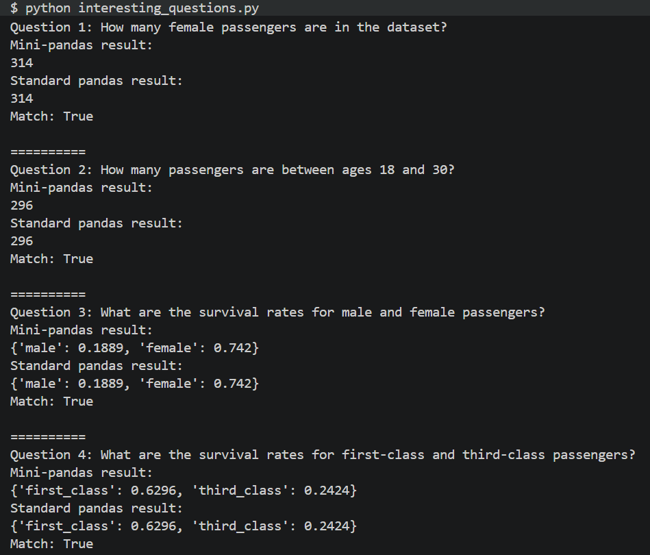

# Mini-Pandas-Package

## Project description

For our team project, we created a simplified pandas-like package in Python for data processing and analysis.

In this project, we tried to recreate a small part of pandas by building our own `Series` and `DataFrame` classes. Our package can read CSV files, filter rows, handle missing values, run simple column operations, group data, and merge tables.

We used the Kaggle Titanic training dataset as the main testing dataset. The goal was to compare the output of our mini-pandas package with the output of the standard pandas package, so that we could check whether our implementation produced reliable results.

## Getting Started

Before running the project, make sure the following tools and packages are installed:

- NumPy
- pandas
- pytest

First, clone the project using:

```
git clone https://github.com/gracexu-crypto/Mini-Pandas-Package
```

Move into the project folder:

```
cd Mini-Pandas-Package
```

Install the required Python packages:

```
pip install numpy pandas pytest
```

To run all tests, use:

```
python -m pytest
```

## Program Output

To demonstrate our project, our team discussed and designed four interesting questions based on the Titanic dataset. We then wrote an interesting_questions.py script that shows the results produced by our mini-pandas package and compares them with the results produced by the standard pandas package.

Here is the result:

For details about the script, you can refer to the `interesting_questions.py` file.

The results were actually pretty surprising to us.
For example, we expected first-class passengers to have a higher survival rate than third-class passengers, but the actual difference was still surprising. The survival rate of first-class passengers(62.96%) is nearly three times that of third-class passengers(24.24%)!

## Challenges and Solutions

### Grace:

Implementing Boolean indexing and filtering was one of the biggest challenges for me in this project. At first, it seemed like I only needed to check whether each row satisfied a condition, but once I started writing the code, I realized there were several details to handle at the same time. The program needed to create a Boolean mask, make sure the mask had the same length as the `DataFrame`, keep the original column structure, and return a new filtered table without changing the original data.

I solved this by adding a helper method inside `DataFrame` to handle row filtering. This made the logic clearer because the filtering process was separated from normal column selection. After that, I was able to support filtering by sex, passenger class, age range, chained conditions, and empty results.

Another challenge appeared when I implemented `merge`. At first, I thought merging two tables only meant finding rows with the same key value, but the details became more complicated once I started writing it. The function needed to support `inner` and `left` joins, handle rows from the left table that did not have a match, and deal with columns that had the same name in both tables.

I solved this by first building a dictionary from the right table, where each key stored the row positions that matched that key. Then I looped through the left table and used that dictionary to find matching rows. For `left` joins, if there was no matching row, I kept the left row and filled the right-side columns with `None`. I also added suffixes like `_x` and `_y` for overlapping column names, which made the final merged table much closer to pandas behavior.

In general, my biggest takeaway from this project was that the hardest part was not only writing individual functions, but also making sure all the pieces worked together correctly. This made me realize that as a project gets bigger, keeping the parts connected correctly becomes just as important as writing each function.

### Danielle:

One of the biggest challenges for me during this project was making sure our mini-pandas package actually produced the same results as pandas. At first, I thought writing the tests would be pretty straightforward, but once I started comparing outputs, I realized there were a lot of small edge cases that could cause problems. Some functions worked on simple examples but gave different results when there were missing values, empty filters, or larger datasets like the Titanic dataset.

To solve this, I created a lot of test cases using pytest and directly compared our outputs with pandas outputs. I tested DataFrame creation, Series behavior, filtering, aggregation functions, GroupBy operations, and merge behavior. Comparing our package to pandas helped us find bugs faster because we could immediately see where something was off.

Another challenge for me was implementing aggregation functions like sum, mean, count, min, and max while handling missing values correctly. At first, the count function counted missing values too, which made some of our results different from pandas. I fixed this by updating the logic so missing values like None or empty strings were ignored during calculations. After that, the outputs matched pandas much more closely.

Overall, this project made me realize how important testing and debugging are when building software. Writing the actual function was sometimes the easier part; the harder part was making sure everything worked together correctly and handled different situations without breaking. I also learned a lot more about how pandas works internally and gained more experience working with Python classes, pytest, GitHub collaboration, and debugging code as part of a team.
